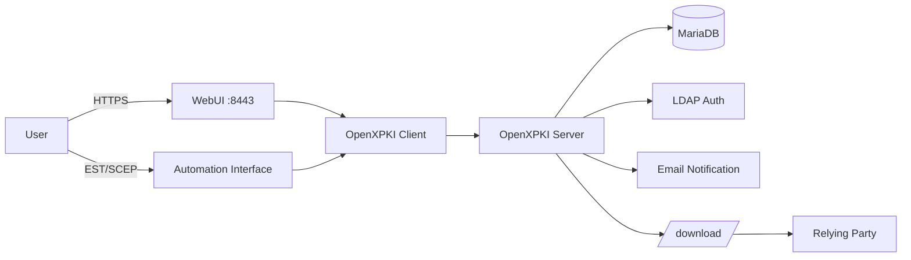
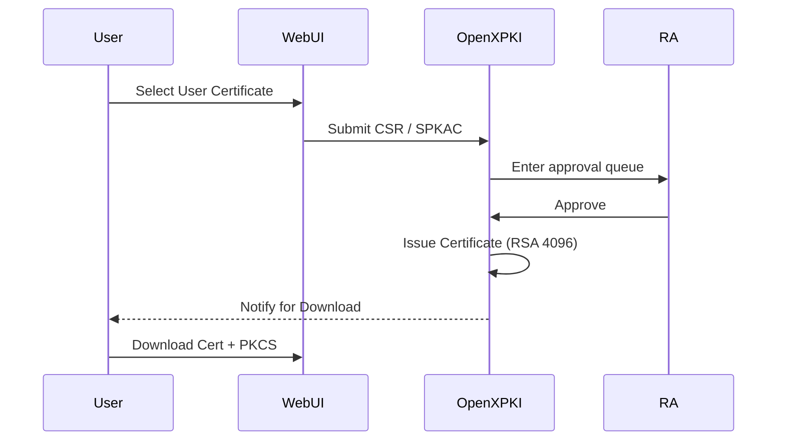
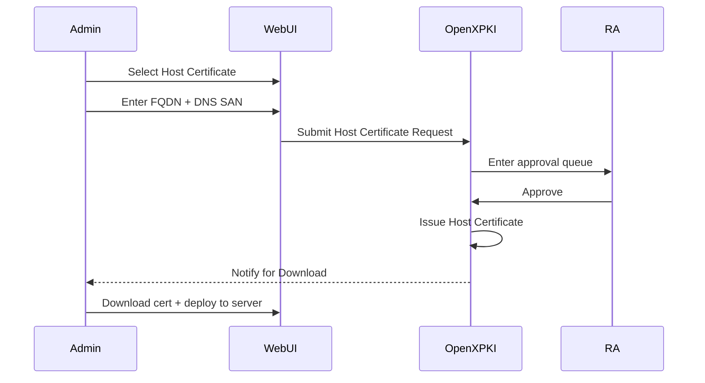
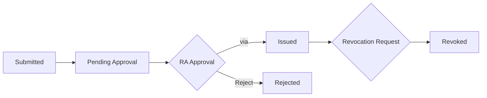
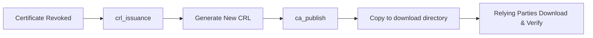
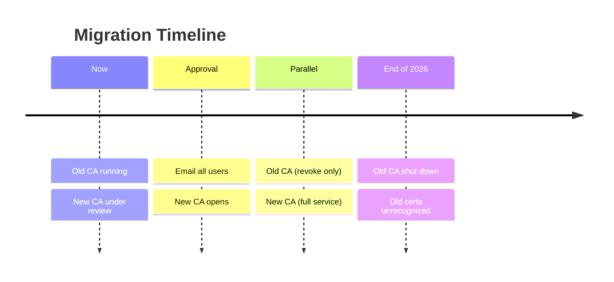

### The Upgrade of IHEP Grid Certification Authority

#### <mdi-certificate /> OpenXPKI · Certificate Lifecycle Automation

**Xiao Han · on behalf of IHEP Computing Center** 
<Email v="hanx@ihep.ac.cn" />

May 31st 2026, Dalian, 
<a href="https://indico.ihep.ac.cn/event/28920" class="ns-c-iconlink"><mdi-open-in-new />8th Workshop of Belle II China Group</a>, 
<a href="https://github.com/hanx-hep/27th-junocm-dci" class="ns-c-iconlink"><mdi-open-in-new />GitHub Repository</a>

---
layout: side-title
title: Table of Contents
color: rose-light
align: cm-lm
---

:: title ::

# Outline

:: content ::

- **Background & Pain Points** — Old System Issues
- **From OpenCA to OpenXPKI**
    - **New System Overview** — OpenXPKI Architecture
- **System Architecture** — Components & Flow
    - **Old vs New Comparison** — Key Changes at a Glance
    - **User Entry Points** — WebUI / API / Download
    - **Certificate Workflow** — Request → Approve → Issue
    - **CRL & Publishing** — Revocation & Relying Parties
- **Migration Plan** — Next Steps

---
layout: section
color: cyan-light
---

# Background & Pain Points

---
layout: top-title
color: gray-light
---
:: title ::
# Background & Pain Points — Problems with the Old System

:: content ::
<mdi-alert-circle /> The current **P**ublic **K**ey **I**nfrastructure(PKI) system [cagrid.ihep.ac.cn](https://cagrid.ihep.ac.cn) is **outdated**.

**Key Issues of the Old System：**

| Pain Point | Impact |
|---|---|
| Root CA: 1024-bit | Insecure for production use |
| Framework: OpenCA | Outdated, community abandoned for years |
| Manual Offline Issuance | Admin must physically enter an isolated room to operate CA server |
| Manual CRL Publishing | Manual generation/push after revocation — severe delays |

 

<mdi-arrow-right-circle /> A  **automated, auditable, user-friendly**  PKI system is needed.

---
layout: section
color: red-light
---

# From 🔐 OpenCA →  OpenXPKI

---
layout: top-title
color: gray-light
---

:: title ::
# New System Overview — OpenXPKI

:: content ::
<mdi-server-network /> **OpenXPKI** is an enterprise-grade PKI/Trustcenter software for X.509v3 certificate lifecycle management.
Established 2009, open-source (Apache 2.0), maintained by White Rabbit Security GmbH.

**Key Characteristics：**

- Workflow-driven certificate lifecycle — request, approval, issuance, revocation
- Multi-protocol enrollment: EST · SCEP · ACME · SimpleCMC · REST API
- Flexible crypto layer — HSM support via PKCS#11, OpenSSL backend
- Multi-tenant PKI Realms with seamless CA rollover
- YAML-based configuration — auditable, version-controlled, Git-friendly
- Multiple auth methods: LDAP · SAML · OAuth · Client Cert

<mdi-information /> We deploy the `ihepca` realm within OpenXPKI to serve IHEP Grid CA operations。

---
layout: section
color: purple-light
---

# System Architecture

---
layout: top-title
color: gray-light
---

:: title ::
# System Architecture

:: content ::
<mdi-graph /> Understanding OpenXPKI Architecture from the User Perspective。

**Component Layers:** User → Access → Business Logic → Data → Publishing

---
layout: top-title
color: gray-light
---

:: title ::
# Old vs New Comparison

:: content ::
There are **five key dimensions** to compare between the old system and the new one:
| Dimension | The old system (OpenCA) | New System (OpenXPKI) |
|---|---|---|
| Platform URL | cagrid.ihep.ac.cn | gridca.ihep.ac.cn |
| User Entry Points | Basic WebUI | Modern WebUI + CLI + API |
| Issuance Method | Manual offline | Workflow-driven with RA review |
| Approval Mechanism | Offline (email) | Online RA workflow approval |
| Automation Interface | None |EST / SCEP / RPC API |

The RA mechanism is similar in both systems, but the old system used **Offline Approval**, while the new one uses **Online Workflow Approval**。

---
layout: top-title
color: gray-light
---

:: title ::
# User Entry Points

:: content ::
<mdi-web /> Three main entry points for users：

**WebUI (Primary Entry)：**
- [https://gridca.ihep.ac.cn/webui/ihepca/](https://gridca.ihep.ac.cn/webui/ihepca/)

**Public Download Paths：**
- CA Certificate：`/download/<CA_Name>.crt`
- CRL：`/download/<CA_Name>.crl`

**Automation Interface：**
- EST：`/.well-known/est/...`
- SCEP：`/scep/...`
- RPC/API：OpenXPKI Client → Backend Workflow

<mdi-information /> Regular users should primarily use WebUI，Automation Interfaces target bulk integration。

---
layout: top-title
color: gray-light
---

:: title ::
# Login & Roles

:: content ::
<mdi-shield-account /> `ihepca` realm supports multiple auth methods; LDAP + client certs recommended for production。

**User Roles：**

| Role | Permissions |
|---|---|
| **User** | Submit requests, view own certificates and workflows |
| **RA Operator** | Approve requests, revoke certificates, issue CRLs, publish CA/CRL |
| **Anonymous** | Browse public information only |

**Authentication Methods：**
- <mdi-check /> LDAP(IHEP SSO) Username/Password
- <mdi-check /> Client Certificate Login

---
layout: section
color: green-light
---

# Certificate Workflow

---
layout: top-title
color: gray-light
---

:: title ::
# User Certificate Request Flow

:: content ::
<mdi-account-key /> Regular users request via  `User Certificate`  profile。

**Certificate Features：** Server-side key generation · RSA 4096 · clientAuth + emailProtection

**Export Formats：** PKCS#12 · PKCS#8 PEM/DER · Java Keystore · OpenSSL Private Key

---
layout: top-title
color: gray-light
---

:: title ::
# Host Certificate Request Flow

:: content ::
<mdi-server />  via  `Host Certificate`  profile。

**Differences from User Certificates：** Subject is FQDN · serverAuth Purpose

---
layout: top-title
color: gray-light
---

:: title ::
# Certificate Lifecycle Management

:: content ::
<mdi-lifebuoy /> Full lifecycle tracking from request to revocation in WebUI。

**Workflow States：**

 

**Regular users can do in WebUI：**
- Submit new requests · View status · Download certs & keys
- Initiate revocation · View CRL info · Search certs

**RA Operator Additional Permissions：**
- Approve/Reject · Batch revoke · CRL issuance · CA/CRL publish

---
layout: top-title
color: gray-light
---

:: title ::
# CRL & Publishing

:: content ::
<mdi-file-document-alert /> After revocation takes effect, relying parties need the latest CRL to detect it。

**CRL Policy：**
- Validity: 14 days
- Renewal window: 3 days before expiry

**Publishing Flow：**

 

---
layout: top-title
color: gray-light
---

:: title ::
# Auto Notifications & Expiry Alerts

:: content ::
<mdi-bell-ring /> The system has email notifications covering the full lifecycle。

**Notification Scenarios：**

| Event | Recipient |
|---|---|
| New CSR Pending Approval | RA Operator |
| Approve | Applicant |
| Certificate Issued Successfully | Applicant |
| CSR Rejected | Applicant |
| Revocation Pending Approval | RA Operator |
| Certificate Expiring Soon | Certificate Holder |

<mdi-check-circle /> No manual polling needed — system proactively pushes status updates。

---
layout: section
color: orange-light
---

# Migration Plan & Hands-on Training

---
layout: top-title
color: gray-light
---

:: title ::
# Migration Plan & Timeline

:: content ::
<mdi-map-marker-path /> We are currently in the process of obtaining official accreditation.

**Now:** Old CA `cagrid.ihep.ac.cn` is running. New CA presented at **IGTF**, under **APGridPMA** review.

 

<mdi-alert /> After end of 2026, certificates issued by the old CA will **no longer be recognized**.

---
layout: top-title
color: gray-light
---

:: title ::
# Hands-on Training — Login Page

:: content ::
<mdi-login /> Select **IHEP SSO** from the authentication method dropdown, then enter LDAP credentials.

 

  

---
layout: top-title
color: gray-light
---

:: title ::
# Hands-on Training — Home Dashboard

:: content ::
<mdi-home /> After login, you see the main dashboard with Workflows, Certificates, and quick actions.

 

  

---
layout: top-title
color: gray-light
---

:: title ::
# Hands-on Training — Select Certificate Profile

:: content ::
<mdi-form-select /> Go to **Request** -> choose **IHEP User Certificate** or **IHEP Host Certificate**.

 

  

---
layout: top-title
color: gray-light
---

:: title ::
# Hands-on Training — Edit Subject

:: content ::
<mdi-account-edit /> System auto-fills identity fields. Confirm the subject DN and add organization/group info.

 

  

---
layout: top-title
color: gray-light
---

:: title ::
# Hands-on Training — Certificate Info

:: content ::
<mdi-information /> Additional certificate metadata: validity period, key algorithm (RSA 4096), and intended usage.

 

  

---
layout: top-title
color: gray-light
---

:: title ::
# Hands-on Training — Review & Submit

:: content ::
<mdi-clipboard-check /> Final confirmation of all fields before submission. Review carefully, then submit.

 

  

---
layout: top-title
color: gray-light
---

:: title ::
# Hands-on Training — Key Password

:: content ::
<mdi-key-variant /> Server generates a password for private key. **Write it down** - needed later for PKCS#12 export.

 

  

---
layout: top-title
color: gray-light
---

:: title ::
# Hands-on Training — Awaiting Approval

:: content ::
<mdi-clock-outline /> The request enters the RA workflow queue. You can track status in **My Workflows**.

 

  

---
layout: top-title
color: gray-light
---

:: title ::
# Hands-on Training — Certificate Issued

:: content ::
<mdi-certificate /> After RA approval, the certificate is issued. You can now download it from **My Certificates**.

 

  

---
layout: top-title
color: gray-light
---

:: title ::
# Hands-on Training — Download Certificate

:: content ::
<mdi-tray-arrow-down /> Download options include certificate file, PKCS#12 container, and CA certificate chain.

 

  

---
layout: top-title
color: gray-light
---

:: title ::
# Hands-on Training — Set Export Password

:: content ::
<mdi-lock /> Set a password to protect the PKCS#12 export file before downloading.

 

  

---
layout: top-title
color: gray-light
---

:: title ::
# Hands-on Training — Download Complete

:: content ::
<mdi-check-circle /> The certificate and private key have been successfully exported. Proceed to deploy.

 

  

---
layout: credits
color: navy
---

# Thank You

<mdi-certificate-outline /> IHEP Computing Center — PKI Team

OpenXPKI · Docker Compose · Certificate Lifecycle Automation

<mdi-web /> `gridca.ihep.ac.cn`
