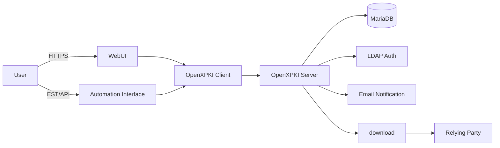
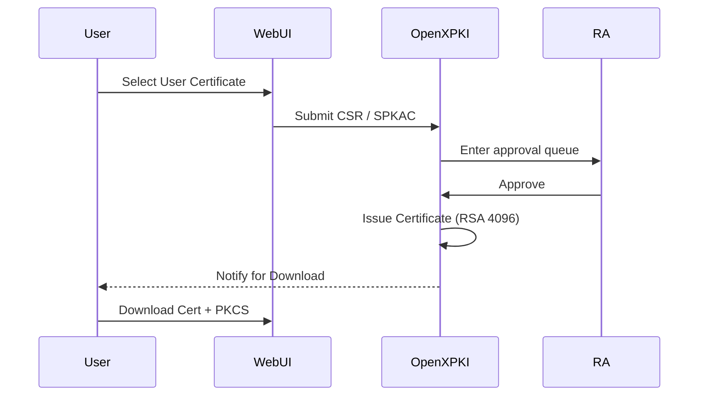
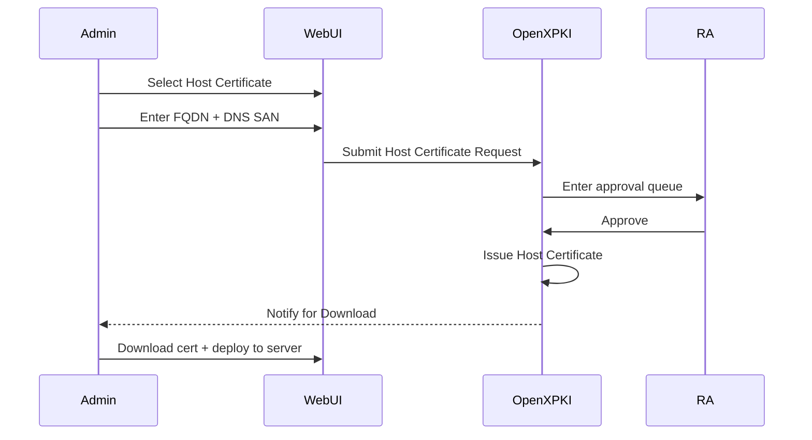
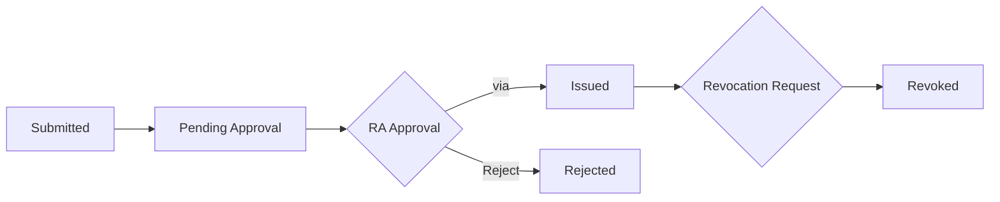
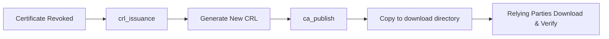
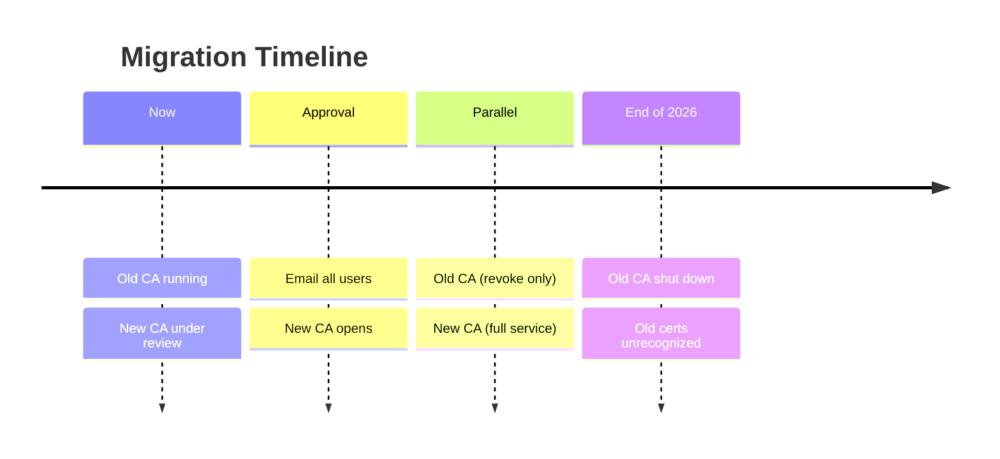

### The Upgrade of IHEP Grid Certification Authority

#### <mdi-certificate /> OpenXPKI · Certificate Lifecycle Automation

<br>

##### **Xiao Han · on behalf of Grid Group, IHEP Computing Center** <a href="mailto:hanx@ihep.ac.cn"></a><Email v="hanx@ihep.ac.cn" />

<br>

##### May 31st 2026, Dalian

<br>

<a href="https://indico.ihep.ac.cn/event/28920" class="ns-c-iconlink"><mdi-open-in-new />8th Workshop of Belle II China Group</a>, <a href="https://github.com/hanx-hep/27th-junocm-dci" class="ns-c-iconlink"><mdi-open-in-new />GitHub Repository</a>


---
layout: side-title
title: Table of Contents
color: rose-light
align: cm-lm
---

:: title ::

# Outline

:: content ::

- **Background**
- **From OpenCA to OpenXPKI**
    - *New System Overview*
- **System Architecture**
    - *Old vs New Comparison*
    - *User Entry Points*
    - *Certificate Workflow*
    - *CRL & Publishing*
- **Migration Plan**
- **Hands-on Training**
- **Summary**

---
layout: section
color: cyan-light
---

# Background

---
layout: top-title-two-cols
color: gray-light
---

:: title ::
# What is a PKI & Why Does Belle II Analysis Need It?

:: left ::

<AdmonitionType type='info' >
<mdi-certificate /> A <b>P</b>ublic <b>K</b>ey <b>I</b>nfrastructure(<b>PKI</b>, <b>C</b>ertificate <b>A</b>uthority) is a trusted entity that issues and manages X.509 digital certificates used to verify identities in networked environments.<br><br> IHEP operates its own Grid PKI to serve the all of High Energy Physics researchers in China.
</AdmonitionType>

**Belle II relies on Grid Computing**

- Certificates are the foundation of **Grid authentication**
- Every Belle II member accessing computing resources must hold a valid grid certificate
- Without a working PKI → no certificates → no grid access → no analysis workflow

:: right ::
**Belle II Analysis Workflow**

- <mdi-function-variant /> **[gBASF2](https://software.belle2.org/development/sphinx/online_book/computing/gbasf2.html)** requires a valid grid certificate to access distributed data and submit analysis jobs. 
```
$ source /cvmfs/belle.kek.jp/grid/gbasf2/pro/bashrc
Proxy generated:
subject      : /C=JP/O=KEK/OU=CRC/CN=USERNAME
issuer       : /C=JP/O=KEK/OU=CRC/CN=USERNAME
identity     : /C=JP/O=KEK/OU=CRC/CN=USERNAME
timeleft     : 23:53:58
DIRAC group  : belle
rfc          : True
path         : /tmp/x100up_u0001
username     : youruser
properties   : NormalUser
VOMS         : True
VOMS fqan    : ['/belle']

Succeed with return value:
0
```

---
layout: top-title-two-cols
color: gray-light
---
:: title ::
# Background — Problems with the Old System

:: left ::
<AdmonitionType type='important' >
The current PKI system <a href="https://cagrid.ihep.ac.cn"><mdi-open-in-new />cagrid.ihep.ac.cn</a> is <b>outdated</b>.
</AdmonitionType>
<br>
<div style="text-align: center; max-width: 100%; margin: 0 auto;">
  
  <div style="font-size:0.8em;color:#888;margin-top:4px;"><mdi-web /> cagrid.ihep.ac.cn — current CA web interface</div>
</div>

:: right ::

| **Key Issues** | **Impact** |
|---|---|
| Root CA Key **1024-bit**  |  Insecure and outdated for WLCG |
| Framework **OpenCA** | Outdated, community abandoned for years |
| Issuance Manual **Offline** | Admin must physically enter an isolated room to issue CA |
| **Manual** CRL Publishing | Manual generation/push after revocation — severe delays |

<AdmonitionType type='note' >
An <b>automated, modernized</b> PKI system is needed.
</AdmonitionType>

---
layout: section
color: red-light
---

# From **OpenCA** to **OpenXPKI**

---
layout: top-title
color: gray-light
---

:: title ::
# New System Overview — OpenXPKI

:: content ::
<mdi-server-network /> **OpenXPKI** is an enterprise-grade PKI/Trustcenter software for X.509v3 certificate lifecycle management.
Established 2009, open-source (Apache 2.0), maintained by White Rabbit Security GmbH.

**Key Characteristics：**

- Workflow-driven certificate lifecycle — request, approval, issuance, revocation
- Multi-protocol enrollment: EST · SCEP · ACME · SimpleCMC · REST API
- Flexible crypto layer — HSM support via PKCS#11, OpenSSL backend
- Multi-tenant PKI Realms with seamless CA rollover
- YAML-based configuration — auditable, version-controlled, Git-friendly
- Multiple auth methods: LDAP · SAML · OAuth · Client Cert


---
layout: section
color: purple-light
---

# System Architecture

---
layout: top-title
color: gray-light
---

:: title ::
# System Architecture

:: content ::
<mdi-graph /> Understanding OpenXPKI Architecture from the User Perspective。

<div style="text-align: center; max-width: 85%; margin: 0 auto;">


</div>

**Component Layers:** User → Access → Business Logic → Data → Publishing


---
layout: top-title
color: gray-light
---

:: title ::
# Old vs New Comparison

:: content ::
There are **five key dimensions** to compare between the old system and the new one:
| Dimension | The old system (OpenCA) | New System (OpenXPKI) |
|---|---|---|
| Platform URL | cagrid.ihep.ac.cn | gridca.ihep.ac.cn |
| User Entry Points | Basic WebUI | Modern WebUI + CLI + API |
| Issuance Method | Manual offline | Workflow-driven with RA review |
| Approval Mechanism | Offline (email) | Online RA workflow approval |
| Automation Interface | None |EST / RPC API |

The RA mechanism is similar in both systems, but the old system used **Offline Approval**, while the new one uses **Online Workflow Approval**。

---
layout: top-title
color: gray-light
---

:: title ::
# User Entry Points

:: content ::
<mdi-web /> Three main entry points for users：

**WebUI (Primary Entry)：**
- [https://gridca.ihep.ac.cn/webui/ihepca/](https://gridca.ihep.ac.cn/webui/ihepca/)

**Public Download Paths：**
- CA Certificate：`/download/<CA_Name>.crt`
- CRL：`/download/<CA_Name>.crl`

**Automation Interface：**
- EST：`/.well-known/est/...`
- RPC/API：OpenXPKI Client → Backend Workflow

<AdmonitionType type='info' >
Regular users should primarily use WebUI，Automation Interfaces target bulk integration。
</AdmonitionType>

---
layout: top-title
color: gray-light
---

:: title ::
# Login & Roles

:: content ::
<mdi-shield-account /> `ihepca` realm supports multiple auth methods; LDAP + client certs recommended for production。

**User Roles：**

| Role | Permissions |
|---|---|
| **User** | Submit requests, view own certificates and workflows |
| **RA Operator** | Approve requests, revoke certificates, issue CRLs, publish CA/CRL |
| **Anonymous** | Browse public information only |

**Authentication Methods：**
- <mdi-check /> LDAP(IHEP SSO) Username/Password
- <mdi-check /> Client Certificate Login

---
layout: section
color: green-light
---

# Certificate Workflow

---
layout: top-title
color: gray-light
---

:: title ::
# User Certificate Request Flow

:: content ::
<mdi-account-key /> Regular users request via  `User Certificate`  profile。

<div style="text-align: center; max-width: 85%; margin: 0 auto;">


</div>

**Certificate Features：** Server-side key generation · RSA 4096 · clientAuth + emailProtection

**Export Formats：** PKCS#12 · PKCS#8 PEM/DER · Java Keystore · OpenSSL Private Key

---
layout: top-title
color: gray-light
---

:: title ::
# Host Certificate Request Flow

:: content ::
<mdi-server />  via  `Host Certificate`  profile。

<div style="text-align: center; max-width: 85%; margin: 0 auto;">


</div>

**Differences from User Certificates：** Subject is FQDN · serverAuth Purpose

---
layout: top-title
color: gray-light
---

:: title ::
# Certificate Lifecycle Management

:: content ::
<mdi-lifebuoy /> Full lifecycle tracking from request to revocation in WebUI。

**Workflow States：**

<br>

<div style="text-align: center; max-width: 85%; margin: 0 auto;">


</div>

**Regular users can do in WebUI：**
- Submit new requests · View status · Download certs & keys
- Initiate revocation · View CRL info · Search certs

**RA Operator Additional Permissions：**
- Approve/Reject · Batch revoke · CRL issuance · CA/CRL publish

---
layout: top-title
color: gray-light
---

:: title ::
# CRL & Publishing

:: content ::
<mdi-file-document-alert /> After revocation takes effect, relying parties need the latest CRL to detect it。

**CRL Policy：**
- Validity: 14 days
- Renewal window: 3 days before expiry

**Publishing Flow：**

<br>

<div style="text-align: center; max-width: 85%; margin: 0 auto;">


</div>


---
layout: top-title
color: gray-light
---

:: title ::
# Auto Notifications & Expiry Alerts

:: content ::

**<mdi-bell-ring /> The system has email notifications covering the full lifecycle**

| Event | Recipient |
|---|---|
| New CSR Pending Approval | RA Operator |
| Approve | Applicant |
| Certificate Issued Successfully | Applicant |
| CSR Rejected | Applicant |
| Revocation Pending Approval | RA Operator |
| Certificate Expiring Soon | Certificate Holder |

<AdmonitionType type='note' >
No manual polling needed — system proactively pushes status updates。
</AdmonitionType>

---
layout: section
color: orange-light
---

# Migration Plan

---
layout: top-title
color: gray-light
---

:: title ::
# Migration Plan & Timeline

:: content ::
<mdi-map-marker-path /> We are currently in the process of obtaining official accreditation.

**Now:** Old CA `cagrid.ihep.ac.cn` is running. New CA presented at **IGTF**, under **APGridPMA** review.

<div style="text-align: center; max-width: 90%; margin: 0 auto;">



</div>

<AdmonitionType type='warning' >
After end of 2026, certificates issued by the old CA will <b>no longer be recognized</b>.
</AdmonitionType>

---
layout: section
color: blue-light
---

# Hands-on Training


---
layout: top-title
color: gray-light
---

:: title ::
# Hands-on Training — Login Page

:: content ::
<mdi-login /> Select **IHEP SSO** from the authentication method dropdown, then enter LDAP credentials.

<br>
<br>

<div style="text-align: center; max-width: 90%; margin: 0 auto;">

<div style="text-align: center; max-width: 90%; margin: 0 auto;">
  
</div>

</div>

---
layout: top-title
color: gray-light
---

:: title ::
# Hands-on Training — Home Dashboard

:: content ::
<mdi-home /> After login, you see the main dashboard with Workflows, Certificates, and quick actions.

<br>
<br>

<div style="text-align: center; max-width: 90%; margin: 0 auto;">

<div style="text-align: center; max-width: 90%; margin: 0 auto;">
  
</div>

</div>

---
layout: top-title
color: gray-light
---

:: title ::
# Hands-on Training — Select Certificate Profile

:: content ::
<mdi-form-select /> Go to **Request** -> choose **User Certificate** or **Host Certificate**.

<br>
<br>

<div style="text-align: center; max-width: 90%; margin: 0 auto;">

<div style="text-align: center; max-width: 90%; margin: 0 auto;">
  
</div>

</div>

---
layout: top-title
color: gray-light
---

:: title ::
# Hands-on Training — Edit Subject

:: content ::
<mdi-account-edit /> System auto-fills identity fields. Confirm the subject DN and add organization/group info.

<br>
<br>

<div style="text-align: center; max-width: 90%; margin: 0 auto;">

<div style="text-align: center; max-width: 90%; margin: 0 auto;">
  
</div>

</div>

---
layout: top-title
color: gray-light
---

:: title ::
# Hands-on Training — Certificate Info

:: content ::
<mdi-information /> Fill in additional request details such as application reason(comments) before submission.

<br>
<br>

<div style="text-align: center; max-width: 90%; margin: 0 auto;">

<div style="text-align: center; max-width: 90%; margin: 0 auto;">
  
</div>

</div>

---
layout: top-title
color: gray-light
---

:: title ::
# Hands-on Training — Review & Submit

:: content ::
<mdi-clipboard-check /> Final confirmation of all fields before submission. Review carefully, then submit.

<br>
<br>

<div style="text-align: center; max-width: 90%; margin: 0 auto;">

<div style="text-align: center; max-width: 90%; margin: 0 auto;">
  
</div>

</div>

---
layout: top-title
color: gray-light
---

:: title ::
# Hands-on Training — Key Password

:: content ::
<mdi-key-variant /> Server generates a password for private key. **Write it down** - needed later for PKCS#12 export.

<br>
<br>

<div style="text-align: center; max-width: 90%; margin: 0 auto;">

<div style="text-align: center; max-width: 90%; margin: 0 auto;">
  
</div>

</div>

---
layout: top-title
color: gray-light
---

:: title ::
# Hands-on Training — Awaiting Approval

:: content ::
<mdi-clock-outline /> The request enters the RA workflow queue. You can track status in **My Workflows**.

<br>
<br>

<div style="text-align: center; max-width: 90%; margin: 0 auto;">

<div style="text-align: center; max-width: 90%; margin: 0 auto;">
  
</div>

</div>

---
layout: top-title
color: gray-light
---

:: title ::
# Hands-on Training — Certificate Issued

:: content ::
<mdi-certificate /> After RA approval, the certificate is issued. You can now download it from **My Certificates**.

<br>
<br>

<div style="text-align: center; max-width: 90%; margin: 0 auto;">

<div style="text-align: center; max-width: 90%; margin: 0 auto;">
  
</div>

</div>

---
layout: top-title
color: gray-light
---

:: title ::
# Hands-on Training — Download Certificate

:: content ::
<mdi-tray-arrow-down /> Download options include certificate file, PKCS#12 container, and CA certificate chain.

<br>
<br>

<div style="text-align: center; max-width: 90%; margin: 0 auto;">

<div style="text-align: center; max-width: 90%; margin: 0 auto;">
  
</div>

</div>

---
layout: top-title
color: gray-light
---

:: title ::
# Hands-on Training — Set Export Password

:: content ::
<mdi-lock /> Set a password to protect the PKCS#12 export file before downloading.

<br>
<br>

<div style="text-align: center; max-width: 90%; margin: 0 auto;">

<div style="text-align: center; max-width: 90%; margin: 0 auto;">
  
</div>

</div>

---
layout: top-title
color: gray-light
---

:: title ::
# Hands-on Training — Download Complete

:: content ::
<mdi-check-circle /> The certificate and private key have been successfully exported. Proceed to deploy.

<br>
<br>

<div style="text-align: center; max-width: 90%; margin: 0 auto;">

<div style="text-align: center; max-width: 90%; margin: 0 auto;">
  
</div>

</div>

---
layout: section
color: amber-light
---

# Summary

---
layout: top-title
color: gray-light
---

:: title ::
# Summary

:: content ::
The IHEP Grid CA upgrade addresses long-standing pain points with a modern, automated PKI.

- **From OpenCA to OpenXPKI** — 1024-bit to RSA 4096-bit
- **Automated Certificate Lifecycle** — WebUI request → RA online approval → auto-issue → download
- **Multi-Protocol & Auto CRL** — EST · RPC API for programmatic access, auto-signing + auto-publishing CRLs, email notifications throughout
- **Under Accreditation** — IGTF / APGridPMA review in progress, parallel run with old CA until end of 2026

---
layout: credits
color: navy
speed: 0.35
title: credits/people
---

<div class="grid text-size-4 grid-cols-3 w-3/4 gap-y-10 auto-rows-min ml-auto mr-auto">
    <div class="grid-item text-center mr-0- col-span-3">
        <strong><mdi-certificate-outline /> IHEP Computing Center — PKI Team</strong><br> 
    </div>
    <div class="grid-item text-right mr-4 col-span-1">
        <strong>Reporter</strong>
    </div>
    <div class="grid-item col-span-2">
        Xiao Han        <i>IHEP, CC</i><br/>
    </div>
    <div class="grid-item text-right mr-4 col-span-1">
         <strong>Current Developer</strong>
    </div>
    <div class="grid-item col-span-2">
        Xiao Han        <i>IHEP, CC</i><br/>
    </div>
    <div class="grid-item text-right mr-4 col-span-1">
        <strong>People</strong>
    </div>
    <div class="grid-item col-span-2">
        Gongxing SUN   ·    <i>RA Administrator</i><br/>
        Tian YAN       ·    <i>CA Administrator (former)</i><br/>
        Xiao HAN       ·    <i>CA Administrator</i><br/>
    </div>
    <div class="grid-item text-right mr-4 col-span-1">
        <strong>Acknowledgements</strong>
    </div>
    <div class="grid-item col-span-2">
        The Interoperable Global Trust Federation(IGTF)<br/>
        The Asia Pacific Grid Policy Management Authority(APGridPMA)<br/>
        APGridPMA Chair · Eisaku SAKANE<br/>
        APGridPMA Former Chair · Eric YEN<br/>
        The European Policy Management Authority for Grid Authentication(EUGridPMA)<br/>
    </div>
    <div class="grid-item text-center mr-0- col-span-3">
        <strong><mdi-web /> <a href="https://gridca.ihep.ac.cn/webui/ihepca/"><mdi-open-in-new />gridca.ihep.ac.cn</a> </strong><br/>
    </div>
</div>

<div class="grid-item col-span-3 text-center mt-180px mb-auto font-size-1.5rem">
    <strong>Questions?</strong>
</div>
<div class="grid-item text-center col-span-3 mt-180px mb-auto font-size-2rem">
    Thank you!
</div>
