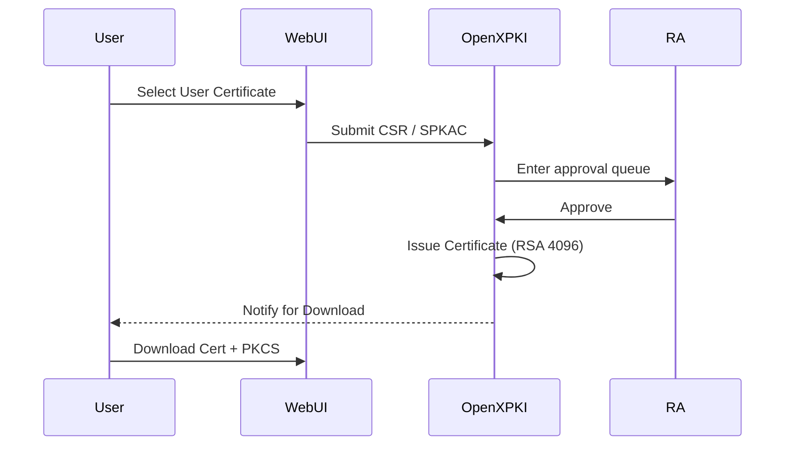
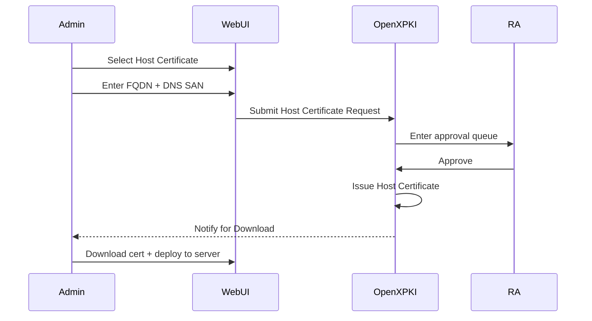
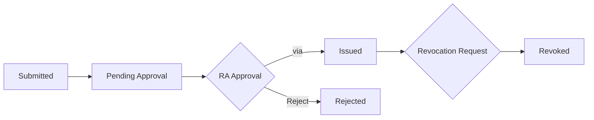
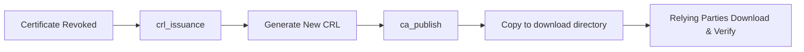
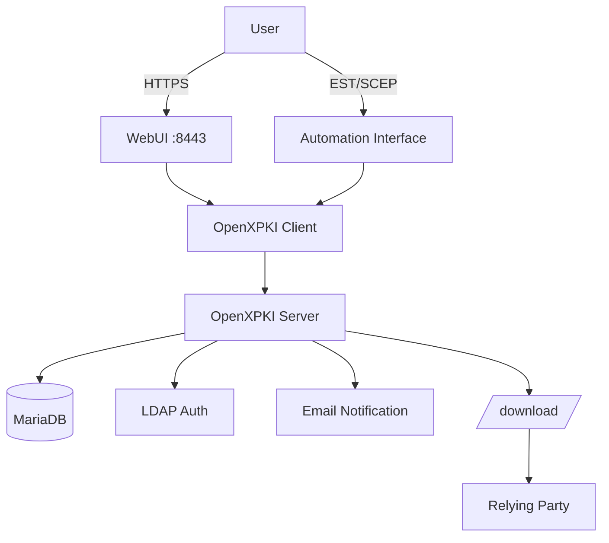

### The Upgrade of IHEP Grid Certification Authority

<mdi-certificate /> OpenXPKI · Certificate Lifecycle Automation

**Xiao Han · IHEP Computing Center** <a href="mailto:hanx@ihep.ac.cn"><Email v="hanx@ihep.ac.cn" /></a>
May 30th 2026

<a href="https://indico.ihep.ac.cn/event/28920" class="ns-c-iconlink"><mdi-open-in-new />8th Workshop of Belle II China Group, Dalian</a>

<a href="https://github.com/hanx-hep/27th-junocm-dci" class="ns-c-iconlink"><mdi-open-in-new />GitHub Repository</a>

---
layout: side-title
title: Table of Contents
color: rose-light
align: cm-lm
---

:: title ::

# Table of Contents

:: content ::

- **Background & Pain Points** — Old System Issues
- **Old vs New Comparison** — Key Changes at a Glance
- **New System Overview** — OpenXPKI Architecture
- **User Entry Points** — WebUI / API / Download
- **Certificate Workflow** — Request → Approve → Issue
- **CRL & Publishing** — Revocation & Relying Parties
- **System Architecture** — Components & Flow
- **Migration Plan** — Next Steps

---
layout: section
color: cyan-light
---

# Background & Pain Points

---
layout: top-title
color: gray-light
---
:: title ::
# Background & Pain Points — Problems with the Old System

:: content ::
<mdi-alert-circle /> The old system `cagrid.ihep.ac.cn`，the issuance workflow relied on manual offline operations。

**Key Issues of the Old System：**

| Pain Point | Impact |
|---|---|
| Manual Offline Issuance | Admin must SSH into server to intervene — low efficiency |
| OpenCA — Unmaintained | Outdated framework, community abandoned for years |
| Manual CRL Publishing | Manual generation/push after revocation — severe delays |
| Root CA — 1024-bit | Insecure for production use |

 

<mdi-arrow-right-circle /> A  **automated, auditable, user-friendly**  PKI system is needed.

---
layout: top-title
color: gray-light
---

:: title ::
# New System Overview — OpenXPKI

:: content ::
<mdi-server-network /> Built on **OpenXPKI** stack。

**Primary realm：** `ihepca` — Serves regular users and RA operators, covering all certificate operations。

**Core Capabilities：**

- Submit certificate requests, renewals, and revocations via WebUI
- RA operators approve via online workflows
- Auto-publish CA certificates and CRLs
- Supports EST / SCEP / RPC API Automation Interface
- Multiple auth methods: LDAP / Client Cert / Local Account

---
layout: top-title
color: gray-light
---

:: title ::
# Old vs New Comparison

:: content ::
There are **five key dimensions** to compare between the old system and the new one:
| Dimension | The old system (OpenCA) | New System (OpenXPKI) |
|---|---|---|
| Platform URL | cagrid.ihep.ac.cn | gridca.ihep.ac.cn |
| User Entry Points | Basic WebUI | Modern WebUI + CLI + API |
| Issuance Method | Manual offline | Workflow-driven, fully automated |
| Approval Mechanism | Offline (email) | Online RA workflow approval |
| CRL Publishing | Manual generation & push | Auto-signing + auto-publishing |
| Automation Interface | None |EST / SCEP / RPC API |

The RA mechanism is similar in both systems, but the old system used **Offline Approval**, while the new one uses **Online Workflow Approval**。

---
layout: top-title
color: gray-light
---

:: title ::
# User Entry Points

:: content ::
<mdi-web /> Three main entry points for users：

**WebUI (Primary Entry)：**
- `https://gridca.ihep.ac.cn/webui/ihepca/`

**Public Download Paths：**
- CA Certificate：`/download/<CA_Name>.crt`
- CRL：`/download/<CA_Name>.crl`

**Automation Interface：**
- EST：`/.well-known/est/...`
- SCEP：`/scep/...`
- RPC/API：OpenXPKI Client → Backend Workflow

<mdi-information /> Regular users should primarily use WebUI，Automation Interfaces target bulk integration。

---
layout: top-title
color: gray-light
---

:: title ::
# Login & Roles

:: content ::
<mdi-shield-account /> `ihepca` realm supports multiple auth methods; LDAP + client certs recommended for production。

**User Roles：**

| Role | Permissions |
|---|---|
| **User** | Submit requests, view own certificates and workflows |
| **RA Operator** | Approve requests, revoke certificates, issue CRLs, publish CA/CRL |
| **Anonymous** | Browse public information only |

**Authentication Methods：**
- <mdi-check /> LDAP(IHEP SSO) Username/Password
- <mdi-check /> Client Certificate Login

---
layout: top-title
color: gray-light
---

:: title ::
# User Certificate Request Flow

:: content ::
<mdi-account-key /> Regular users request via  `User Certificate`  profile。

**Certificate Features：** Server-side key generation · RSA 4096 · clientAuth + emailProtection

**Export Formats：** PKCS#12 · PKCS#8 PEM/DER · Java Keystore · OpenSSL Private Key

---
layout: top-title
color: gray-light
---

:: title ::
# Host Certificate Request Flow

:: content ::
<mdi-server />  via  `Host Certificate`  profile。

**Differences from User Certificates：** Subject is FQDN · serverAuth Purpose

---
layout: top-title
color: gray-light
---

:: title ::
# Certificate Lifecycle Management

:: content ::
<mdi-lifebuoy /> Full lifecycle tracking from request to revocation in WebUI。

**Workflow States：**

**Regular users can do in WebUI：**
- Submit new requests · View status · Download certs & keys
- Initiate revocation · View CRL info · Search certs

**RA Operator Additional Permissions：**
- Approve/Reject · Batch revoke · CRL issuance · CA/CRL publish

---
layout: top-title
color: gray-light
---

:: title ::
# CRL & Publishing

:: content ::
<mdi-file-document-alert /> After revocation takes effect, relying parties need the latest CRL to detect it。

**CRL Policy：**
- Validity: 14 days
- Renewal window: 3 days before expiry

**Publishing Flow：**

<mdi-alert /> **IMPORTANT:** Do not rely on WebUI alone — verify new CRL is published to download directory。

---
layout: top-title
color: gray-light
---

:: title ::
# Auto Notifications & Expiry Alerts

:: content ::
<mdi-bell-ring /> The system has email notifications covering the full lifecycle。

**Notification Scenarios：**

| Event | Recipient |
|---|---|
| New CSR Pending Approval | RA Operator |
| Approve | Applicant |
| Certificate Issued Successfully | Applicant |
| CSR Rejected | Applicant |
| Revocation Pending Approval | RA Operator |
| Certificate Expiring Soon | Certificate Holder |

<mdi-check-circle /> No manual polling needed — system proactively pushes status updates。

---
layout: top-title
color: gray-light
---

:: title ::
# System Architecture

:: content ::
<mdi-graph /> Understanding OpenXPKI Architecture from the User Perspective。

**Component Layers:** User → Access → Business Logic → Data → Publishing

---
layout: top-title
color: gray-light
---

:: title ::
# Migration Plan & Recommendations

:: content ::
<mdi-map-marker-path /> Key steps before production launch。

**Pre-Launch Checklist：**

| Item | Status | Notes |
|---|---|---|
| Replace placeholder URLs | ⚠️ | Clean up placeholder domains in config |
| Production domain + cert chain | ⚠️ | gridca.ihep.ac.cn |
| User Migration | 📋 | Import old certs or re-request |
| RA Training | 📋 | Approval workflow + CRL operations |
| Monitoring Deployment | 📋 | Service status + certificate expiry alerts |

**Recommended User Guidelines：**
- Prefer using `ihepca` WebUI for operations
- Retrieve private key container securely after issuance
- Verify CRL is published after revocation

---
layout: default
color: gray-light
---

# Hands-on Training — Dashboard After Login

<mdi-monitor-screenshot /> Dashboard view after logging in via IHEP SSO (LDAP username/password)。

**Navigation：** Home · Request · Information · Cert Search · CRL Download

---
layout: default
color: gray-light
---

# Hands-on Training — Request Certificate (Select Profile)

<mdi-form-select /> Go to Request → Select Certificate Profile。

**Available Profiles：** IHEP User Certificate · IHEP Host Certificate

---
layout: default
color: gray-light
---

# Hands-on Training — Fill in Certificate Subject

<mdi-account-edit /> System auto-fills identity fields (name, short account, email)。

User only needs to add organization/group and notes, then confirm to enter approval。

---
layout: default
color: gray-light
---

# Hands-on Training — Key Password

<mdi-key-variant /> After server-side key generation, the system displays the key protection password。

<mdi-alert-circle /> **IMPORTANT: ** Note the password — needed for PKCS#12 download later。

---
layout: default
color: gray-light
---

# Hands-on Training — Review Before Submission

<mdi-clipboard-check /> Final confirmation of certificate request details。

Submit after confirmation; wait for RA online approval。

---
layout: default
color: gray-light
---

# Hands-on Training — Edit Certificate Info

<mdi-pencil /> RA Operator or User can edit/supplement certificate info in workflow。

Supports modifying Subject DN, SAN, Purpose etc. (requires permission)。

---
layout: default
color: gray-light
---

# Hands-on Training — Download & Deployment

<mdi-tray-arrow-down /> After approval, download from "My Certificates"。

**Download Contents：**
- Issued end-entity certificate (PEM)
- Private Key Container (PKCS#12 / PKCS#8)
- CA Certificate Chain
- Latest CRL (from  `/download/` Directory）

**Deployment Recommendations：**
- User cert → Import to browser/mail client
- Host cert → Deploy to `/etc/grid-security/`
- Key file permissions: `chmod 400` or `600`

---
layout: default
color: gray-light
---

# Hands-on Training — FAQ

<mdi-help-circle /> Common questions about the new system。

| Question | Answer |
|---|---|
| Login Failed | Ensure IHEP SSO is selected, use LDAP credentials |
| Certificate Not Showing | Check Workflow status — may still be in approval |
| Cannot Download Private Key | Key can only be downloaded once after issuance |
| Certificate Expiring | System sends auto alerts — renew in advance |
| CRL Not Updated | Contact RA Operator to trigger `crl_issuance` |
| Browser Shows Insecure | Production cert chain pending deployment |

---
layout: credits
color: navy
---

# Thank You

<mdi-certificate-outline /> IHEP Computing Center — PKI Team

OpenXPKI · Docker Compose · Certificate Lifecycle Automation

<mdi-web /> `gridca.ihep.ac.cn`
